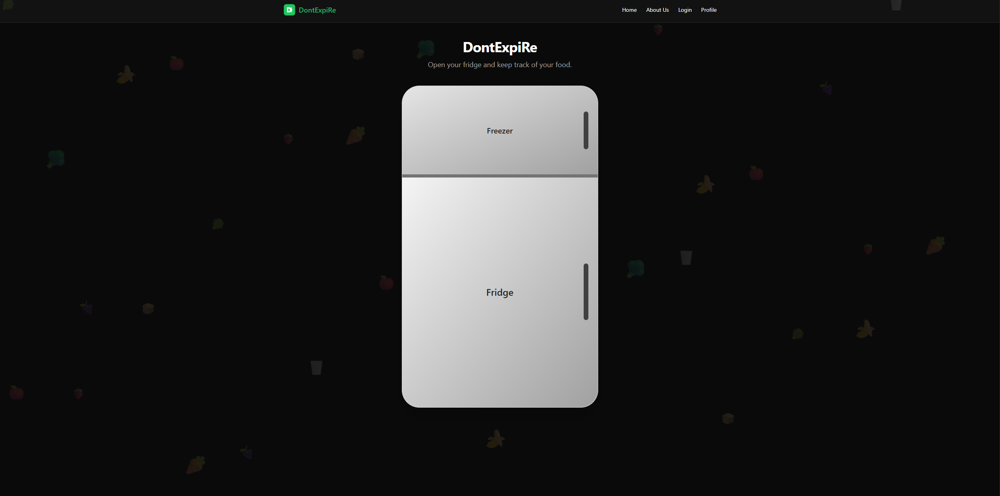
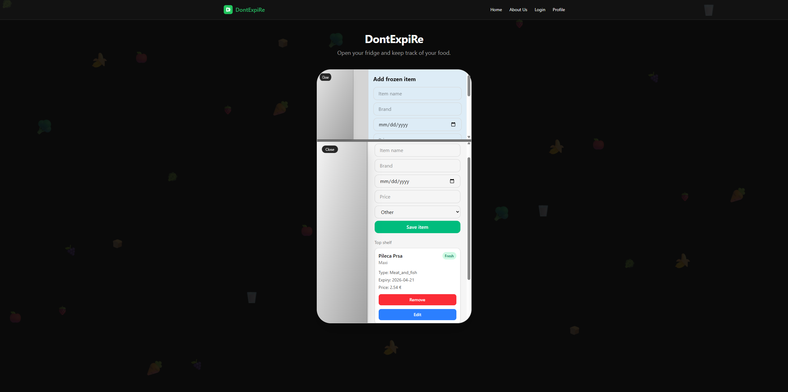
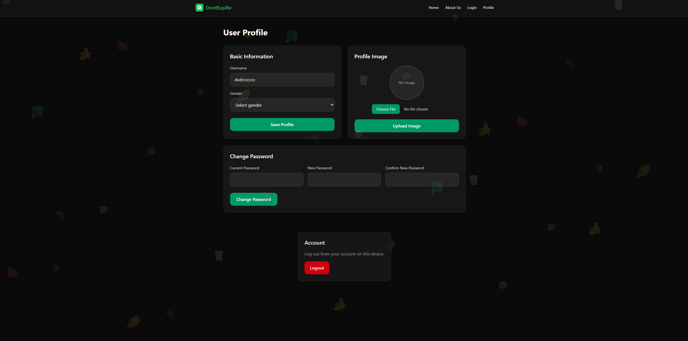
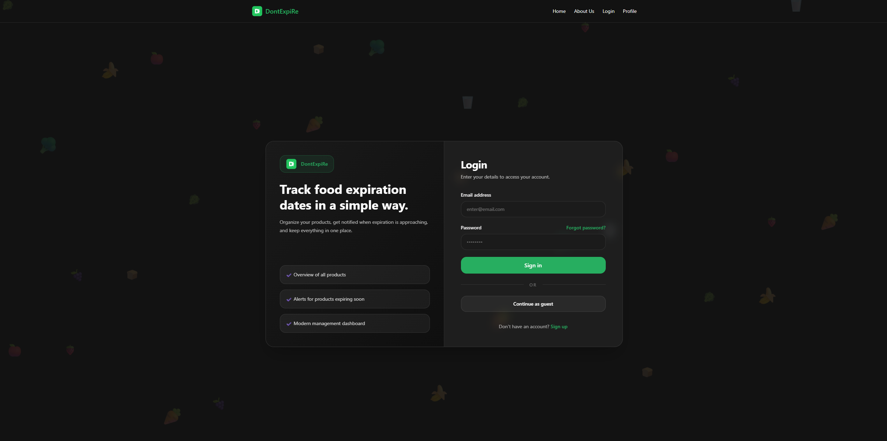
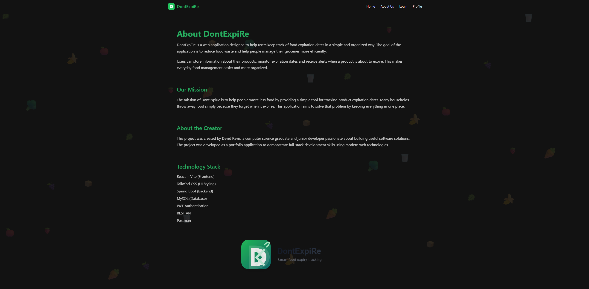

# DontExpiRe

A personal web application for tracking food expiration dates and managing fridge and freezer items.

## Tech Stack
- Java
- Spring Boot
- React
- Vite
- Tailwind CSS
- MySQL
- JWT Authentication

## Features
- User registration and login
- JWT-based authentication
- User profile management
- Add, edit, and delete products
- Separate fridge and freezer sections
- Expiration date tracking
- Interactive fridge-inspired UI

## Screenshots

### Main Page

### Open Fridge

### User Profile

### Login Page

### About Us Page
